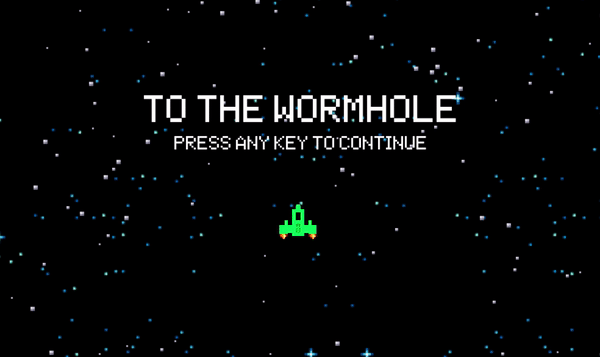
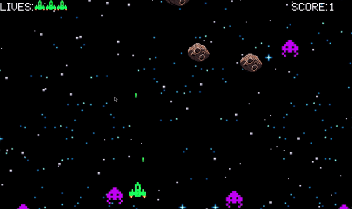

To The wormhole

To run this game you must have python ver. 3.7 and pygame module installed on your computer. 

clone the repository on your computer, or download the zip folder from the clone/download option on repository page.

Current objective of this game is to survive for as long as possible and achive the highest possible score 
during that time. The enemy ships will come towards the player and can be hit using the bullets(space). If
they hit the player ship, the player loses a life. The player will die after all three of their lives have been exhausted.
Along with the enemy ships, the player also has to avoid the incoming asteroids from the top right side of the screen. 

Note: Only the enemy ships give points upon hitting. 

Refrences and sources utilized in making this Pygame:
1. https://github.com/leerob/Space_Invaders - helpful open source space invaders game, that inspired me quite a bit
2. https://techwithtim.net/ - helpful pygame tutorial
3. The sprites and media used were taken from google images and other sources that I've forgotten. 

Start menu

Game play 

